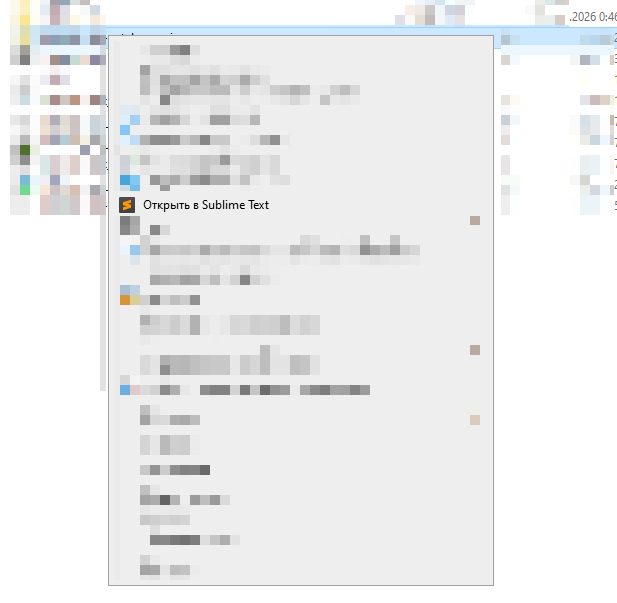

# Sublime Text — Context menu icon

Bat-скрипт для добавления иконки Sublime Text в контекстное меню Windows.  
Работает для файлов, папок и фона папки (правый клик по пустому месту внутри папки).



---

## Возможности

- Добавляет иконку Sublime Text в контекстное меню
- Выбор языка пункта меню — русский или английский
- Автоматически удаляет старые записи перед добавлением новых
- Отключает восстановление сессии Sublime для корректного открытия папок
- Полный откат — удаление иконок и возврат стандартных настроек

---

## Меню скрипта

```
[1] - Русский     "Открыть в Sublime Text"
[2] - English     "Open with Sublime Text"
[3] - Вернуть стандартное поведение Sublime
[4] - Удалить иконки и вернуть все настройки
[0] - Выход
```

---

## Установка

1. Скачай файл `Sublime_Text_-_Context_menu_icon.bat`
2. Нажми правой кнопкой мыши → **Запуск от имени администратора**
3. Выбери язык пункта меню
4. Готово

> Sublime Text должен быть установлен по стандартному пути:  
> `C:\Program Files\Sublime Text\sublime_text.exe`  
> Если путь отличается — отредактируй переменную `SUBLIME_PATH` в скрипте.

---

## Что делает скрипт с настройками Sublime

При выборе пункта [1] или [2] скрипт автоматически применяет в `Preferences.sublime-settings`:

```json
{
    "hot_exit": false,
    "remember_open_files": false
}
```

Это отключает восстановление сессии — без этих настроек при открытии папки через контекстное меню Sublime открывал два окна.

Вернуть стандартное поведение можно через пункт **[3]** или **[4]**.

---

## Системные требования

- Windows 10 / 11
- Sublime Text 4
- Права администратора

---

## 📄 Лицензия

Скрипт распространяется "как есть" без гарантий.  
Используйте на свой страх и риск.

---

## 👨‍💻 Автор

**NaitSide** · Telegram: [@something_on_the_smart](https://t.me/something_on_the_smart)

---

## 🔗 Ссылки

- [GitHub NaitSide](https://github.com/NaitSide)

---

## 📄 Лицензия

Скрипт распространяется "как есть" без гарантий.  
Используйте на свой страх и риск.

---

## 💝 Поддержка

Если скрипт помог — поставь ⭐ на GitHub!

Нашёл баг или есть предложение? Открой Issue.